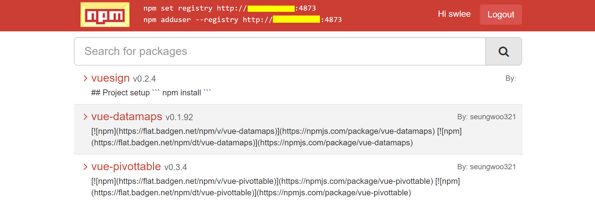

# 비공개 NPM 저장소 구성하기



## 개요

오픈소스 Sinopia를 사용해서 Prvate NPM 저장소를 구성하고 스코프 문제를 해결한 경험을 정리하자.

## 배경

Vue 프레임워크 기반의 비공개 UI 템플릿을 만들게 되었는데, 이 템플릿을 사용해 개발된 프로젝트에서 수시로 업데이트된 내용이 배포 되어야 한다. 패키지 관리는 npm의 장점을 그대로 사용하고 싶어서 Private NPM 저장소를 구축하기로 했다. npm 에서 제공하는 서비스는 비용 문제가 있어서 sinopia 라는 오픈소스를 사용해서 구성 했다.

## 설치 및 사용자 생성

상세한 내용은 [Github README](https://github.com/rlidwka/sinopia)를 확인하자.

```bash
# 글로벌로 패키지 설치
$ npm install -g sinopia

# 서비스 실행
$ sinopia

# 사용자 생성  
$ npm adduser --registry http://localhost:4873/
```

:::tip
브라우저에서 <http://localhost:4873/> 혹은 외부IP:4873 포트로 접속해서 위에서 생성한 사용자로 로그인 해서 정상 설치여부를 확인 하자.
:::

## 백그라운드로 서비스 시작 & 종료

```bash
# 로그 남기지 않고 백그라운드에서 실행하기
$ nohup sinopia 1>/dev/null 2>&1 &

# 종료하기
$ pkill -9 sinopia
```

## 사용방법

* npm 환경설정의 registry를 변경 하고 커맨드 사용

```bash
# 기존 설정 확인 & 저장소 변경
$ npm config list
$ npm set registry http://localhost:4873
```

* 글로벌로 변경하지 않고 커맨드에 옵션을 추가하여 사용

```bash
# 옵션으로 사용
$ npm i --registry http://localhost:4873
$ npm publish --registry http://localhost:4873
```

:::tip
Github 문서의 사용 사례를 보면 주 목적이었던 `개인 패키지 사용` 외 에도 npmjs.org 레지스트리의 캐시 역할도 있기 때문에 개인적으로는 저장소를 변경하는 방식을 선호한다.
:::

## 기본 환경 설정

* 설정 파일은 yaml 형식으로 작성된다.
* default 내용은 [여기](https://github.com/rlidwka/sinopia/blob/master/conf/default.yaml)에서 확인 할 수 있다.
* 홈 디렉토리 하위의`.config/sinopia/config.ymal` 에 위치 한다.

## 주요 이슈 및 해결방법

### 이슈

최근 프론트엔드 프레임워크인 Vue.js, Angular, React 를 살펴 보면 @ (스코프) 가 포함되어 있는 것을 볼 수 있는데, 이렇게 @ (스코프) 가 포함된 패키지를 다운로드 할 때는 패키지를 찾을 수 없다는 404 오류가 발생한다.

### 원인

기본 설정 packages 의 `@*/*` 에는 프록시가 설정되어 있지 않아서 로컬(Private 저장소)에 해당 패키지가 존재하지 않을 경우에는 패키지를 찾지 못 하는 것이다. 이는 개발당시(약 5년전)에는 패키지의 이름에 @(스코프)가 지금 처럼 보편화 되어 사용 되지 않았고, 비공개 패키지 이름에만 사용 하는 용도로 고려되었다 보니 생긴 문제로 보인다.

### 해결방법

아래와 같이 기본 설정 파일에서 `@*/*` 하위 레벨에 `proxy: npmjs` 을 추가해주면, @ (스코프) 가 포함된 패키지를 로컬(Private 저장소)에서 찾지 못 하더라도 `npmjs` 를 통해 정상적으로 패키지를 다운로드 할 수 있게 된다.

```yml{29}
#
# This is the default config file. It allows all users to do anything,
# so don't use it on production systems.
#
# Look here for more config file examples:
# https://github.com/rlidwka/sinopia/tree/master/conf
#

# path to a directory with all packages
storage: ./storage

auth:
  htpasswd:
    file: ./htpasswd
    # Maximum amount of users allowed to register, defaults to "+inf".
    # You can set this to -1 to disable registration.
    #max_users: 1000

# a list of other known repositories we can talk to
uplinks:
  npmjs:
    url: https://registry.npmjs.org/

packages:
  '@*/*':
    # scoped packages
    access: $all
    publish: $authenticated
    proxy: npmjs

  '*':
    # allow all users (including non-authenticated users) to read and
    # publish all packages
    #
    # you can specify usernames/groupnames (depending on your auth plugin)
    # and three keywords: "$all", "$anonymous", "$authenticated"
    access: $all

    # allow all known users to publish packages
    # (anyone can register by default, remember?)
    publish: $authenticated

    # if package is not available locally, proxy requests to 'npmjs' registry
    proxy: npmjs

# log settings
logs:
  - {type: stdout, format: pretty, level: http}
  #- {type: file, path: sinopia.log, level: info}
  ```

## 기타 설정

* 외부에서의 연결과 용량 제한을 늘리기 위해 설정 파일 하단에 `listen`과 `max_body_size` 를 추가 하여 사용 하고 있다.
* 전체 옵션은 [여기](https://github.com/rlidwka/sinopia/blob/master/conf/full.yaml) 에서 확인 하자.

```yaml
listen: 0.0.0.0:4873
max_body_size: 100mb
```

## 참조링크

* [npm-scope](https://docs.npmjs.com/using-npm/scope.html)
* [npm-about-private-packages](https://docs.npmjs.com/about-private-packages)
* [sinopia](https://www.npmjs.com/package/sinopia)

<Comment/>
