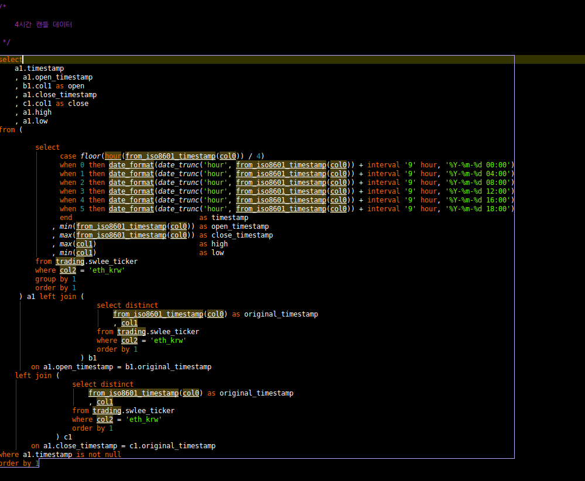
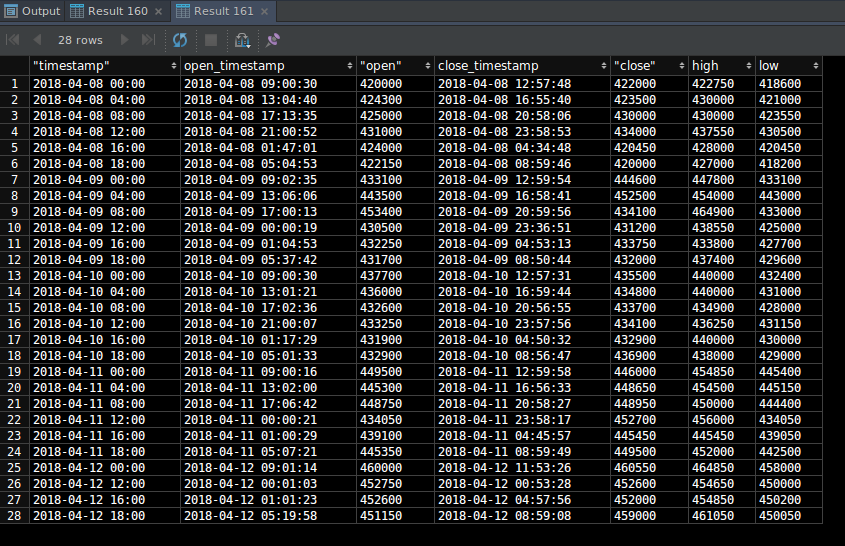

# Amazon Athena SQL로 캔들 데이터 생성 하기

트레이딩 봇 개발 1탄

[[toc]]

> 이 글은 2018년 4월경 진행하면서 기록한 내용을 바탕으로 재작성되었습니다.

## 배경

* 암호화폐 시장을 경험하면서 알고리즘 매매에 흥미가 생겼다.
* 알고리즘 매매를 위해서는 가장 기본이 되는 캔들 데이터가 필요했다.
* 어떻게 실시간 시장 데이터를 가공해서 캔들 데이터를 만들어야 하는지 흥미가 생겼다.
* AWS의 데이터 분석과 관련된 서비스 Glue와 Athena 서비스가 생각났다.

## 수집 및 데이터 가공

### 필요한 데이터

캔들은 **종가(close)**, **고가(high)**, **저가(low)**, **시가(open)** 로 구성되어 있다.

### 가공 프로세스

처음 계획은 노드(node.js)로 코빗 거래소의 ticker API를 정기적으로 호출해서 받은 시장 데이터 중 종목, 가격, 시간 데이터만 키네시스(Kinesis) 서비스로 전송하고 그다음 글루(Glue) 서비스로 ETL 작업을 수행해서 데이터를 가공해 아테나(Athena)에 최종 캔들 테이블을 생성하는 것이었다.

하지만, ETL 작업에 대한 이해도가 부족해 글루 서비스를 사용해 캔들 데이터를 생성하는 데서 막혔다. 가장 간단하게 실행해볼 수 있는 방법을 고민하다가 종목, 가격, 시간 데이터를 가공하지 않은 채로 아테나에 테이블을 만든 다음 SQL만을 사용해서 캔들 데이터를 만들어 보기로 했다.

:::details
ticker API: <https://api.korbit.co.kr/v1/ticker>
:::

## Athena SQL을 사용해 시장 데이터를 캔들 데이터로 가공하기

* 5분 캔들 데이터

```SQL

select
    a1.timestamp
    , a1.open_timestamp
    , b1.col1 as open
    , a1.close_timestamp
    , c1.col1 as close
    , a1.high
    , a1.low
from (
    select
        case floor(minute(from_iso8601_timestamp(col0)) / 5)
            when 0 then date_format(date_trunc('second', from_iso8601_timestamp(col0)) + interval '9' hour, '%Y-%m-%d %H:00')
            when 1 then date_format(date_trunc('second', from_iso8601_timestamp(col0)) + interval '9' hour, '%Y-%m-%d %H:05')
            when 2 then date_format(date_trunc('second', from_iso8601_timestamp(col0)) + interval '9' hour, '%Y-%m-%d %H:10')
            when 3 then date_format(date_trunc('second', from_iso8601_timestamp(col0)) + interval '9' hour, '%Y-%m-%d %H:15')
            when 4 then date_format(date_trunc('second', from_iso8601_timestamp(col0)) + interval '9' hour, '%Y-%m-%d %H:20')
            when 5 then date_format(date_trunc('second', from_iso8601_timestamp(col0)) + interval '9' hour, '%Y-%m-%d %H:25')
            when 6 then date_format(date_trunc('second', from_iso8601_timestamp(col0)) + interval '9' hour, '%Y-%m-%d %H:30')
            when 7 then date_format(date_trunc('second', from_iso8601_timestamp(col0)) + interval '9' hour, '%Y-%m-%d %H:35')
            when 8 then date_format(date_trunc('second', from_iso8601_timestamp(col0)) + interval '9' hour, '%Y-%m-%d %H:40')
            when 9 then date_format(date_trunc('second', from_iso8601_timestamp(col0)) + interval '9' hour, '%Y-%m-%d %H:45')
            when 10 then date_format(date_trunc('second', from_iso8601_timestamp(col0)) + interval '9' hour, '%Y-%m-%d %H:50')
            when 11 then date_format(date_trunc('second', from_iso8601_timestamp(col0)) + interval '9' hour, '%Y-%m-%d %H:55')
        end as timestamp
        , min(from_iso8601_timestamp(col0)) as open_timestamp
        , max(from_iso8601_timestamp(col0)) as close_timestamp
        , max(col1) as high
        , min(col1) as low
    from trading.swlee_ticker
    where col2 = 'eth_krw'
    group by 1
    order by 1
) a1
left join (
    select distinct
        from_iso8601_timestamp(col0) as original_timestamp
        , col1
    from trading.swlee_ticker
    where col2 = 'eth_krw'
    order by 1
) b1
on a1.open_timestamp = b1.original_timestamp
left join (
    select distinct
        from_iso8601_timestamp(col0) as original_timestamp
        , col1
    from trading.swlee_ticker
    where col2 = 'eth_krw'
    order by 1
) c1
on a1.close_timestamp = c1.original_timestamp
where a1.timestamp is not null
order by 1
```

* 30분 캔들 데이터

```SQL
select
    a1.timestamp
    , a1.open_timestamp
    , b1.col1 as open
    , a1.close_timestamp
    , c1.col1 as close
    , a1.high
    , a1.low
from (
    select
        case floor(minute(from_iso8601_timestamp(col0)) / 30)
        when 0 then date_format(date_trunc('second', from_iso8601_timestamp(col0)) + interval '9' hour, '%Y-%m-%d %H:00')
        when 1 then date_format(date_trunc('second', from_iso8601_timestamp(col0)) + interval '9' hour, '%Y-%m-%d %H:30')
        end as timestamp
        , min(from_iso8601_timestamp(col0)) as open_timestamp
        , max(from_iso8601_timestamp(col0)) as close_timestamp
        , max(col1) as high
        , min(col1) as low
    from trading.swlee_ticker
    where col2 = 'eth_krw'
    group by 1
    order by 1
) a1
left join (
    select distinct
        from_iso8601_timestamp(col0) as original_timestamp
        , col1
    from trading.swlee_ticker
    where col2 = 'eth_krw'
    order by 1
) b1
on a1.open_timestamp = b1.original_timestamp
left join (
    select distinct
        from_iso8601_timestamp(col0) as original_timestamp
        , col1
    from trading.swlee_ticker
    where col2 = 'eth_krw'
    order by 1
) c1
on a1.close_timestamp = c1.original_timestamp
where a1.timestamp is not null
order by 1
```

* 1시간 캔들 데이터

```SQL
select
    a1.timestamp
    , a1.open_timestamp
    , b1.col1 as open
    , a1.close_timestamp
    , c1.col1 as close
    , a1.high
    , a1.low
from (
    select
        case floor(minute(from_iso8601_timestamp(col0)))
        when 0 then date_format(date_trunc('hour', from_iso8601_timestamp(col0)) + interval '9' hour, '%Y-%m-%d %H:00')
        end as timestamp
        , min(from_iso8601_timestamp(col0)) as open_timestamp
        , max(from_iso8601_timestamp(col0)) as close_timestamp
        , max(col1) as high
        , min(col1) as low
    from trading.swlee_ticker
    where col2 = 'eth_krw'
    group by 1
    order by 1
) a1 left join (
    select distinct
        from_iso8601_timestamp(col0) as original_timestamp
        , col1
    from trading.swlee_ticker
    where col2 = 'eth_krw'
    order by 1
) b1
on a1.open_timestamp = b1.original_timestamp
left join (
    select distinct
        from_iso8601_timestamp(col0) as original_timestamp
        , col1
    from trading.swlee_ticker
    where col2 = 'eth_krw'
    order by 1
) c1
on a1.close_timestamp = c1.original_timestamp
where a1.timestamp is not null
order by 1
```

* 4시간 캔들 데이터

```SQL
select
    a1.timestamp
    , a1.open_timestamp
    , b1.col1 as open
    , a1.close_timestamp
    , c1.col1 as close
    , a1.high
    , a1.low
from (
    select
        case floor(hour(from_iso8601_timestamp(col0)) / 4)
        when 0 then date_format(date_trunc('hour', from_iso8601_timestamp(col0)) + interval '9' hour, '%Y-%m-%d 00:00')
        when 1 then date_format(date_trunc('hour', from_iso8601_timestamp(col0)) + interval '9' hour, '%Y-%m-%d 04:00')
        when 2 then date_format(date_trunc('hour', from_iso8601_timestamp(col0)) + interval '9' hour, '%Y-%m-%d 08:00')
        when 3 then date_format(date_trunc('hour', from_iso8601_timestamp(col0)) + interval '9' hour, '%Y-%m-%d 12:00')
        when 4 then date_format(date_trunc('hour', from_iso8601_timestamp(col0)) + interval '9' hour, '%Y-%m-%d 16:00')
        when 5 then date_format(date_trunc('hour', from_iso8601_timestamp(col0)) + interval '9' hour, '%Y-%m-%d 18:00')
        end as timestamp
        , min(from_iso8601_timestamp(col0)) as open_timestamp
        , max(from_iso8601_timestamp(col0)) as close_timestamp
        , max(col1) as high
        , min(col1) as low
    from trading.swlee_ticker
    where col2 = 'eth_krw'
    group by 1
    order by 1
) a1 left join (
        select distinct
        from_iso8601_timestamp(col0) as original_timestamp
        , col1
        from trading.swlee_ticker
    where col2 = 'eth_krw'
    order by 1
) b1
on a1.open_timestamp = b1.original_timestamp
left join (
    select distinct
        from_iso8601_timestamp(col0) as original_timestamp
        , col1
    from trading.swlee_ticker
    where col2 = 'eth_krw'
    order by 1
) c1
on a1.close_timestamp = c1.original_timestamp
where a1.timestamp is not null
order by 1

```

## 실행 결과




## 정리

* 가장 기본이 되는 캔들 생성만으로 복잡하고 비용이 많이 든다.
* 글루 서비스에서 생성하는 ticker 테이블이 배치성이라서 실시간 캔들 조회가 어렵다.

원하는 시간 프레임별로 캔들 데이터를 생성하는 SQL 문을 작성하는 것은 성공했지만, 위와 같은 이유들로 비효율적이라고 판단해 작업에 사용된 모든 AWS 리소스(resource)를 삭제하고 다른 방법을 시도하게 되었다.
