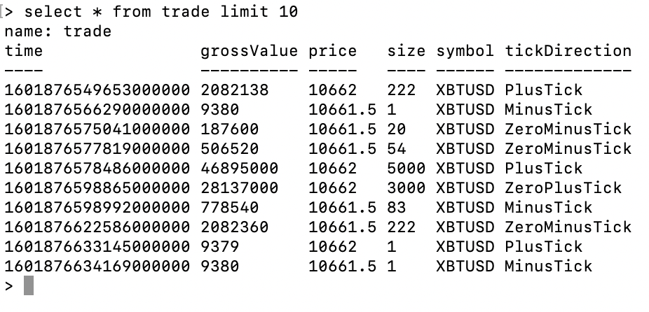

# InfluxDB를 활용한 주식차트 만들기

트레이딩 봇 개발 2탄

[[toc]]

> 이 글은 2020년 10월경 진행하면서 기록한 내용을 바탕으로 재작성되었습니다.

## 배경

* 이전 글에서 진행했던 Amazon Athena SQL로 캔들 데이터 생성하는 방법은 SQL 구문이 길고 복잡하고 비용이 많이 들었다.
* 구글 검색을 통해서 실시간 데이터 처리에 용이한 "시계열 데이터 베이스(TSBD)"의 존재를 알았다.
* 캔들스틱 차트 분석을 학습하면서 차트의 기술적 분석에 흥미가 생겼다.
* 다이내믹한 암호화폐 시장을 경험하면서 기계적 매매의 필요성과 중요성을 깨달았다.

## 데이터 수집

지난번에는 막연히 차트의 기본이 되는 캔들(Candle) 데이터에 대한 흥미로 시작했었다면 이번에는 "실시간 시장 데이터를 분석해서 자동으로 사고파는 프로그램을 만들자"라는 구체적인 목표를 갖고 시작했다.

그 첫 번째 작업으로 거래소의 이벤트를 구독해서 웹 소켓 통신으로 시장 데이터를 제공받고 인플럭스DB(InfluxDB)에 저장하는 노드 (node.js) 서버를 구현했다. 관계형 데이터베이스의 테이블(table)에 대응되는 개념으로 시계열 데이터베이스인 인플럭스DB에는 메저 먼트 (measurements)라는 게 있어서 `trade`라는 이름으로 메저 먼트를 생성해 다음과 같이 실시간 시장 데이터를 저장했다.



## 시장 데이터 가공

실시간으로 저장되는 시장 데이터를 `first`, `last`, `max`, `min` 함수와 `group by time`을 사용해서 쉽게 원하는 타임 프레임(Timeframe)의 캔들로 가공할 수 있다.

```sql
-- 30분 캔들
select 
    first(price) as open,
    max(price) as high,
    min(price) as low,
    last(price) as close, 
    sum(grossValue) as volume 
from trade 
    where symbol='XBTUSD'
group by time(30m) fill(previous)


-- 4시간 캔들
select 
    first(price) as open,
    max(price) as high,
    min(price) as low,
    last(price) as close, 
    sum(grossValue) as volume 
from trade 
    where symbol='XBTUSD'
group by time(4h) fill(previous)
```

## 실시간 캔들 생성

이전에 AWS 글루(Glue) 서비스의 ETL 작업으로 어떻게 해야 될까 고민했던 실시간으로 시장 데이터를 캔들 데이터로 갱신하는 문제 역시 인플럭스DB의 연속 쿼리를 사용해서 쉽게 해결할 수 있었다.

### 연속 쿼리 형식

```sql
CREATE CONTINUOUS QUERY <cq_name> ON <database_name>
RESAMPLE EVERY <infterval> FOR <interval>
BEGIN 
    <cq_query>
```

### 연속 쿼리 적용하기

```sql
-- 30분 캔들
CREATE
    CONTINUOUS QUERY trade_bitmex_to_xbt_usd_candles_30m ON bitmex 
RESAMPLE EVERY 10s FOR 5h 
BEGIN 
    select 
        first(price) as open,
        max(price) as high,
        min(price) as low,
        last(price) as close,
        sum(grossValue) as volume 
    into trade_bitmex_to_xbt_usd_candles_30m 
    from bitmex.autogen.trade
        where symbol='XBTUSD'
    group by time(30m) fill(previous)
END

-- 4시간 캔들
CREATE
    CONTINUOUS QUERY trade_bitmex_to_xbt_usd_candles_4h ON bitmex
RESAMPLE EVERY 10s FOR 40h
BEGIN
    select first(price) as open,
        max(price) as high,
        min(price) as low,
        last(price) as close,
        sum(grossValue) as volume
    into trade_bitmex_to_xbt_usd_candles_4h
    from trade
        where symbol='XBTUSD'
    group by time(4h) fill(previous)
END;

```

## 캔들 스틱 차트그리기

백엔드는 인플럭스DB에서 가공한 캔들 스틱 데이터를 조회하는 새로운 노드 서버를 추가하고 프런트엔드는 뷰(Vue.js)와 오픈소스 (tvjsx/trading-vue-js)를 사용해서 캔들 스틱과 차트의 기술적분석에 주로 사용하려는 이동 평균선(Moving Average), 스토캐스틱(Stochastic), 볼린저 밴드(Bollinger Band) 지표를 시각화했다.


## 정리

인플럭스DB를 사용함으로써 손쉽게 시장 데이터를 캔들로 변환할 수 있어서 알고리즘 매매에 사용할 수 있는 보조지표 값들을 구할 수 있게 되었다. 이 보조지표 값들을 가지고 백테스팅(Backtesting)을 해서 매매 전략을 만들고 거래소의 REST API를 통해서 실제로 사고파는 트레이딩 봇을 만들 수 있게 되었다.

## 참고 링크

* [이전 포스팅 - Amazon Athena SQL로 캔들 데이터 생성하기](/blog/2021/04/25/making-trading-bot-1.html)
* [오픈소스 tvjsx/trading-vue-js](https://github.com/tvjsx/trading-vue-js)

<Comment/>
